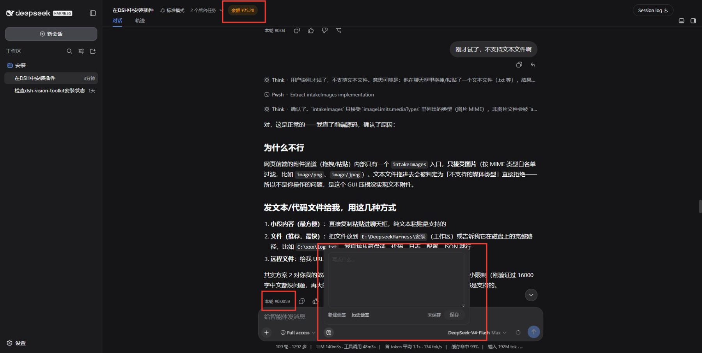
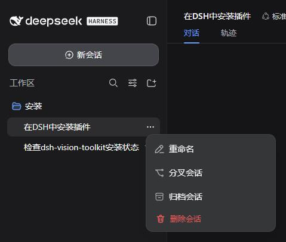

# 🧰 dsh-toolkit — DeepSeek Harness 实用工具箱

[English](README.en.md) | 简体中文

一组**纯增量**的 [DeepSeek Harness](https://github.com/deepseek-ai/deepseek-harness) 原生插件合集：**便签**、**API 余额与费用**、**推理等级**、**删除会话**。

四个插件遵循同一原则：**不改动 Harness 核心**——全部通过官方插槽（slot）与独立 API 路由注入，卸载即完全还原。

## 插件一览

| 插件 | 功能 | 界面位置 |
| --- | --- | --- |
| :memo: **dsh-note** | 原生便签：新建 / 历史 / 拖拽窗口 / 历史条目双击编辑自动保存 | 输入框工具行（Full access 选择器右侧） |
| :moneybag: **dsh-api-balance** | API 余额 + 本轮费用 + 今日消耗（¥ / token，峰谷计价，账户合计与官网一致） | 会话头部操作行 + 每条回复操作行 |
| :brain: **dsh-reasoning-levels** | 第三方模型五档推理等级（low / medium / high / xhigh / max） | 官方模型选择器 |
| :wastebasket: **dsh-session-delete** | 「删除会话」，彻底清理会话数据 | 会话列表 ⋮ 菜单 |

## 界面预览



*输入框工具行的便签按钮与浮层（新建 / 历史 / 保存）、会话头部余额徽章与每条回复的本轮费用。*



*会话列表 ⋮ 菜单中的「删除会话」。*

### :memo: dsh-note — 原生便签

- 输入框工具行一个与周边图标同款的小圆钮（28×28，随主题自动变色）
- 打开即**新建便签**，点击「保存」归档进历史（上限 30 条）；关闭时未保存内容自动存**草稿**防丢
- 「历史便签」弹出**独立窗口**：可自由拖拽、缩放，并**记住最近一次的位置和大小**；条目点击展开显示**复制**按钮，可单独删除
- **历史条目双击即可编辑**：展开内容后双击进入行内编辑，停止输入约 0.6 秒自动保存（显示「已自动保存」），不改变条目位置、不会丢字；编辑中按 ESC 结束
- 文本上限 16,000 字符；数据落盘 `$DSH_HOME/storages/dsh-note.json`（原子写入、并发写串行化）

### :moneybag: dsh-api-balance — API 余额与费用

- **余额徽章**：会话头部操作行。显示当前模型所属供应商的余额——DeepSeek 官方余额接口（**高峰 / 闲时**按北京时间自动标注，与官网峰谷窗口 9:00–12:00、14:00–18:00 对齐）、第三方余额接口或本地记账（总金额 − 已扣）
- **供应商管理**：双击徽章打开「模型计费管理」——可配置多个供应商、每个供应商挂多个模型并共用同一余额池；第三方模型可设置独立的输入 / 输出 / 缓存读 / 缓存写费率
- **本轮费用**：每条 assistant 回复旁显示 `本轮 ¥x.xxxx`，按官方峰谷价或自定义费率精确计价；悬停显示**缓存命中率**与消耗 token（K/M tok）
- **今日消耗**：悬停徽章显示**当日（北京时间）账户全部消耗**——所有供应商 / 模型 / 会话的 token 之和（含缓存命中），与 DeepSeek 官网用量页数字一致
- **切换联动**：切换会话或切换供应商模型时，徽章立即切换为该供应商的余额；同供应商内切换模型则保持不变
- API Key 复用 Harness 凭据服务（`~/.dsh/.credentials.yaml` 的 `DEEPSEEK_API_KEY`），**Key 不进入浏览器**

### :brain: dsh-reasoning-levels — 第三方模型推理等级

- 为第三方模型（pi-ai 供应商）在**官方模型选择器**中提供五档推理等级：**low / medium / high / xhigh / max**；支持五档的模型默认档位为 **Max**（选中即高亮，未手动选择时按 Max 发送）
- 启动时自动为未声明的第三方模型写入五档声明（幂等）；同一供应商内可**混排**支持与不支持档位的模型——`reasoningEfforts: false` 的模型不显示档位、请求不带档位参数、保持供应商默认
- 官方模型保持官方三档（low / high / max），永不触碰
- 附带宿主接口 `getSessionModel` / `setReasoning` / `setModel` / `levels`（模型选择、档位诊断与切换）

### :wastebasket: dsh-session-delete — 删除会话

- 会话列表 ⋮ 菜单新增「删除会话」，**彻底删除**：JSONL 会话日志、工作区登记、归档集合全部清理
- 拒绝删除**运行中**的会话（先停止/关闭再重试）；会话 ID 严格校验，目录路径与核心编码逐字符一致，删除范围精确限定在存储根内（含符号链接防护）
- 删除前弹窗确认并展示会话 ID；重名会话拒绝猜测，避免误删

## 仓库结构

```
dsh-toolkit/
├── packages/
│   ├── dsh-note/                # 便签插件
│   ├── dsh-api-balance/         # 余额与费用插件
│   ├── dsh-reasoning-levels/    # 第三方模型推理等级插件
│   └── dsh-session-delete/      # 删除会话插件
├── pnpm-workspace.yaml          # pnpm monorepo 聚合
└── README.md
```

四个包相互独立：可**单独安装、单独更新、单独卸载**，互不依赖。

## 安装

要求：DeepSeek Harness v0.1.0-rc.7+（Web 界面，Windows 实测）。

```bash
# 1. 克隆仓库
git clone https://github.com/Vast-Unhurried/dsh-toolkit.git
cd dsh-toolkit

# 2. 安装插件（可只装需要的）
dsh plugin --profile web add file:./packages/dsh-note
dsh plugin --profile web add file:./packages/dsh-api-balance
dsh plugin --profile web add file:./packages/dsh-reasoning-levels
dsh plugin --profile web add file:./packages/dsh-session-delete
```

> `--profile web` 按你的实际 profile 名调整；`file:` 支持相对路径，从仓库根目录执行即可。

安装后需**重启 dsh 服务**（宿主路由 + 客户端 bundle 都需要重新加载），浏览器 **Ctrl+Shift+R** 硬刷新。

## 卸载

```bash
dsh plugin --profile web remove dsh-note
dsh plugin --profile web remove dsh-api-balance
dsh plugin --profile web remove dsh-reasoning-levels
dsh plugin --profile web remove dsh-session-delete
```

卸载即完全还原。便签数据文件（`$DSH_HOME/storages/dsh-note.json`）默认保留，如需彻底清除手动删除该文件；`dsh-reasoning-levels` 卸载后可按需清理 `settings.yaml` 中 `llm-pi-ai` 下插件写入的 `reasoningEfforts` / `reasoning` / `compat.supportsReasoningEffort` 字段。

## 兼容性与安全边界

- 客户端只读官方插槽：`conversation.input.left`、`conversation.session.header.actions`、`conversation.chat.assistant-actions` 等
- 宿主侧仅新增独立 API 路由（`/plugins/dsh-note/api`、`/plugins/api-balance/api`、`/plugins/reasoning-levels/api`、`/plugins/session-delete/api`），不修改、不订阅任何核心状态
- 所有 API 路由做同源校验（要求 Host 为回环地址且 Origin 与 Host 精确一致），拒绝跨站与 DNS rebinding 请求
- 不收集任何遥测；不读取凭据以外的敏感信息；不向第三方发送数据

## License

[MIT](./LICENSE)
