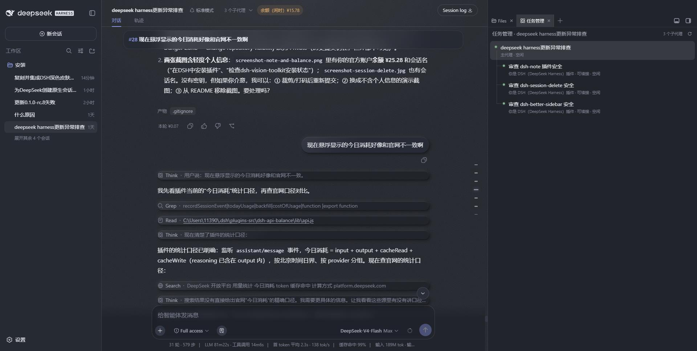

# dsh-softui-skin

**DeepSeek Harness web 的轻拟物(Soft-UI)皮肤插件** —— 奶油浅色与墨蓝深色两套配色,
完整的光影、材质、纹理、磨砂玻璃与微交互动画,通过一个**系统原生开关**控制。

> **修改自 [Lhy723/dsh-neu-theme](https://github.com/Lhy723/dsh-neu-theme)（MIT）**：
> 皮肤样式与配色沿用原项目,本插件将原来的三选一选择器改为「设置 → 通用设置 → 外观」
> 中的**系统原生开关**,浅色/深色变体跟随系统原生外观,并做了多处健壮性修复。



## 行为

- 开关位于 **设置 → 通用设置 → 外观**（内置「外观」行正下方），是一个与 Harness
  设计令牌一致的原生风格开关（`role="switch"`，浅/深色下都跟随主题令牌）。
- **打开开关**：启用轻拟物皮肤。浅色 / 深色两种变体**跟随系统原生外观**——
  - 原生外观为深色（或「跟随系统」且系统处于深色）→ 皮肤深色（墨蓝夜）；
  - 原生外观为浅色 → 皮肤浅色（奶油暖白）；
  - 原生外观为「跟随系统」时，操作系统切换深浅色，皮肤变体自动跟随。
- **关闭开关**：页面与 Harness 原生完全一致——不注入样式、不打 body 标记、
  不残留任何令牌覆盖。
- **持久化**：开关状态保存在 `localStorage` 的 `dsh-softui:enabled`，每次启动时恢复。
  **刷新、关闭浏览器、重启 dsh 都不会让皮肤还原回原生外观**（只要开关保持打开）。
  （旧版本使用的 `dsh-neu:enabled` 键会在首次读取时自动迁移并清理。）

## 实现方式（不碰 Harness 核心）

- 皮肤颜色通过内置 ThemeRuntime 的 `overrideTokens()` 叠加为**令牌覆盖层**：
  - 浅色/深色取值按当前激活的原生配色方案自动选取（`{ light, dark }` 成对提供）；
  - **不写入** `ui-theme` 偏好、不修改 `settings.yaml`、不注册主题条目；
    关闭开关即整体移除，原生外观原样恢复。
- 阴影/磨砂/噪点等增强样式是插件自有 `<style>`，只在开关打开时挂载，全部规则
  以 `body[data-dsh-softui]` 为作用域。
- 开关行通过 `settings.general.item` 槽注册（顺序 19，紧跟内置「外观」行，
  该行顺序 10）。
- 多标签页通过 `storage` 事件同步开关状态；构建期校验全部 103 个主题令牌为合法
  CSS 颜色。

## 安装

```sh
# 方式一：直接从 GitHub 安装
dsh plugin --profile web add "github:Vast-Unhurried/dsh-toolkit#path:packages/dsh-softui-skin"

# 方式二：clone 后本地安装
cd ~/dsh-toolkit
dsh plugin --profile web add file:./packages/dsh-softui-skin
```

安装后重启 `dsh web`，浏览器 **Ctrl+Shift+R** 硬刷新。

## 开发

```sh
npm run build   # 从 src/client.tpl.js + themes/*.json 重新生成 lib/client.js
npm run check   # 语法检查构建产物
```

## 仓库结构

```
dsh-softui-skin/
├── package.json          # dsh.bundle.patch + dsh.client 清单
├── cordis.patch.yml      # loader entry 插入(id: softui-skin)
├── themes/               # softui-light.json / softui-dark.json — 调色板
├── src/                  # 源码（模板 + 构建脚本，构建产物在 lib/）
└── lib/                  # 生成产物（git 忽略）
```

## License

[MIT](./LICENSE)（皮肤样式与配色 © Lhy723/dsh-neu-theme）
